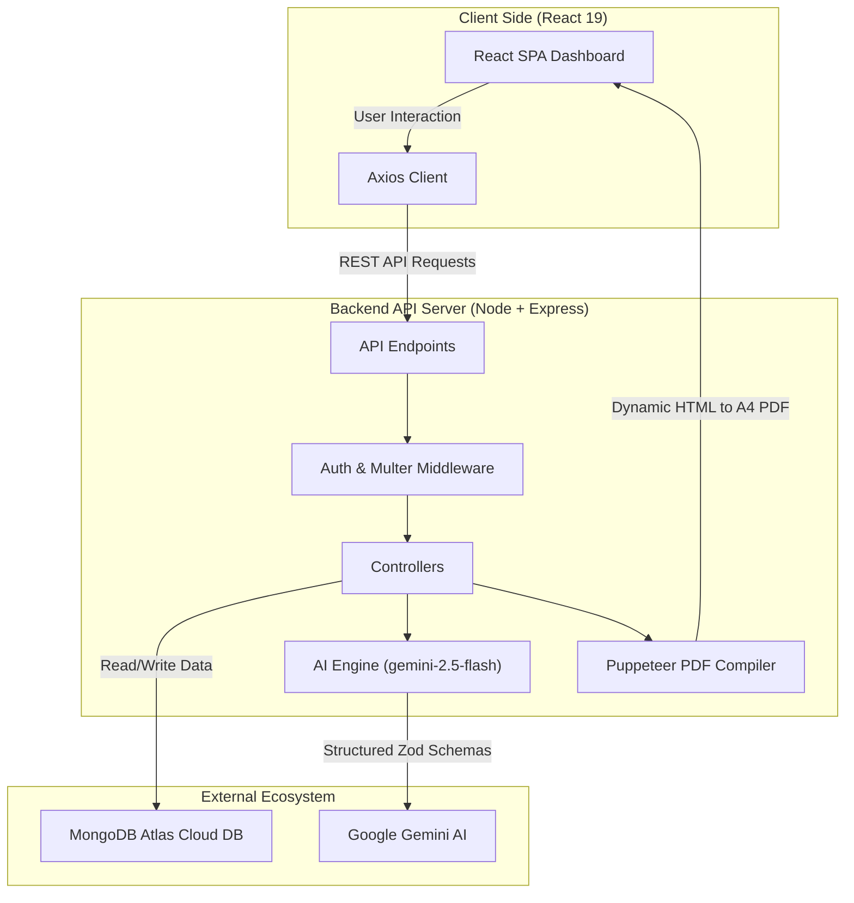

# AI-Prep: AI-Powered Full-Stack Interview Preparation Platform

**AI-Prep** is a production-grade, full-stack web application built on the **MERN (MongoDB, Express, React, Node.js) stack** that leverages **Google Gemini (GenAI)** to construct tailored mock interviews, identify skill gaps, and dynamically render custom ATS-friendly resumes. 

Designed for modern SDE candidates, this platform automates the alignment between a candidate's profile (resume & self-description) and targeted job requirements, providing a data-driven, structured roadmap to interview success.

---

## 🏗️ System Architecture

The application is structured as a decoupled full-stack architecture built to handle file uploads, asynchronous AI processing, and dynamic PDF generation.



```text
interview-ai-yt-main/
├── Backend/              # Node.js + Express API Server
│   ├── src/
│   │   ├── config/      # Database & Environment Configuration
│   │   ├── controllers/ # Request controllers (Auth, AI Report Engine)
│   │   ├── middlewares/ # Multer file upload & JWT validation middlewares
│   │   ├── models/      # Mongoose Schemas (User, Report, BlacklistedToken)
│   │   ├── routes/      # REST API endpoints
│   │   └── services/    # Google GenAI Integration & Puppeteer PDF Compiler
│   ├── server.js        # Server entry point
│   └── package.json
│
└── Frontend/             # React 19 Client Dashboard
    ├── src/
    │   ├── features/    # Module-based features (Auth, Interview)
    │   ├── style/       # Modular SCSS styling
    │   ├── app.routes.jsx# React Router v7 configurations
    │   └── main.jsx     # Frontend entry point
    └── package.json
```

---

## 🛠️ Key Technical Implementations

### 1. Structured GenAI Schema Enforcements
Rather than relying on raw text LLM responses, the platform integrates the official `@google/genai` SDK with **Zod Schemas** to enforce structured JSON output formats.
*   The AI service maps the output schema to Zod objects using `zod-to-json-schema`, guaranteeing the model (`gemini-2.5-flash`) responds with valid JSON matching fields such as `matchScore`, `technicalQuestions`, `behavioralQuestions`, `skillGaps`, and a day-wise `preparationPlan`.
*   This approach eliminates AI hallucination and parsing issues, providing a seamless data flow from the LLM to MongoDB and the React frontend.

### 2. PDF Parsing & Headless Browser Rendering
*   **Resume Reading**: The backend parses uploaded PDF resumes using a binary stream reader (`pdf-parse`) and feeds raw text parameters directly into the AI prompt runner.
*   **Tailored PDF Exports**: The AI model generates a custom, ATS-friendly HTML template matching the target job description. The backend instantiates a headless **Puppeteer** instance to compile the generated HTML into a print-ready A4 PDF binary stream, serving it back to the client as an immediate file download attachment.

### 3. Production-Ready Configuration & CORS
*   Fully stateless session design utilizing secure, HTTP-Only **JWT (JSON Web Token)** cookie-based authentication.
*   CORS policies, server port bindings, and API requests dynamically scale using environmental variables (`FRONTEND_URL`, `VITE_API_BASE_URL`), allowing the application to be deployed seamlessly across separate cloud hosting services.

---

## 🛠️ Tech Stack & Dependencies

*   **Frontend**: React (v19), React Router (v7), Vite, Sass/SCSS, Axios (custom HTTP client)
*   **Backend**: Node.js, Express.js (v5), MongoDB, Mongoose ODM
*   **Generative AI**: Google Gen AI SDK (`@google/genai`), Gemini 2.5 Flash
*   **Document Processing**: Puppeteer (headless PDF engine), PDF-parse, Multer (multipart form parser)
*   **Security & Auth**: JWT (jsonwebtoken), BcryptJS (salted password hashing), Cookie-Parser

---

## ⚙️ Environment Configuration

Create a `.env` file in the `/Backend` directory:
```env
PORT=3000
MONGO_URI=mongodb+srv://<username>:<password>@cluster.mongodb.net/ai-prep
JWT_SECRET=your_jwt_signing_secret_key
GOOGLE_GENAI_API_KEY=your_gemini_api_key
```

Create a `.env` file in the `/Frontend` directory:
```env
VITE_API_BASE_URL=http://localhost:3000
```

---

## 🚀 Local Quickstart

### 1. Start the Backend API Server
```bash
cd Backend
npm install
npm run dev
```
Server runs on: `http://localhost:3000`

### 2. Start the Frontend React Client
```bash
cd Frontend
npm install
npm run dev
```
Development client runs on: `http://localhost:5173`

---

## 🌐 Cloud Deployment (Render Production Config)

### 📦 Frontend Deploy (Render Static Site)
*   **Build Command**: `npm run build`
*   **Publish Directory**: `dist`
*   **Environment Variables**:
    *   `VITE_API_BASE_URL`: `https://your-backend-service.onrender.com`

### ⚙️ Backend Deploy (Render Web Service)
*   **Build Command**: `npm install`
*   **Start Command**: `node server.js`
*   **Environment Variables**:
    *   `MONGO_URI` (MongoDB Atlas production URI)
    *   `JWT_SECRET` (Secure JWT key)
    *   `GOOGLE_GENAI_API_KEY` (Gemini API key)
    *   `FRONTEND_URL` (URL of your deployed static frontend)
    *   `PUPPETEER_SKIP_CHROMIUM_DOWNLOAD` = `true` (Tells Puppeteer to bypass downloading chromium and use Render's built-in chromium instance to save space/time)
