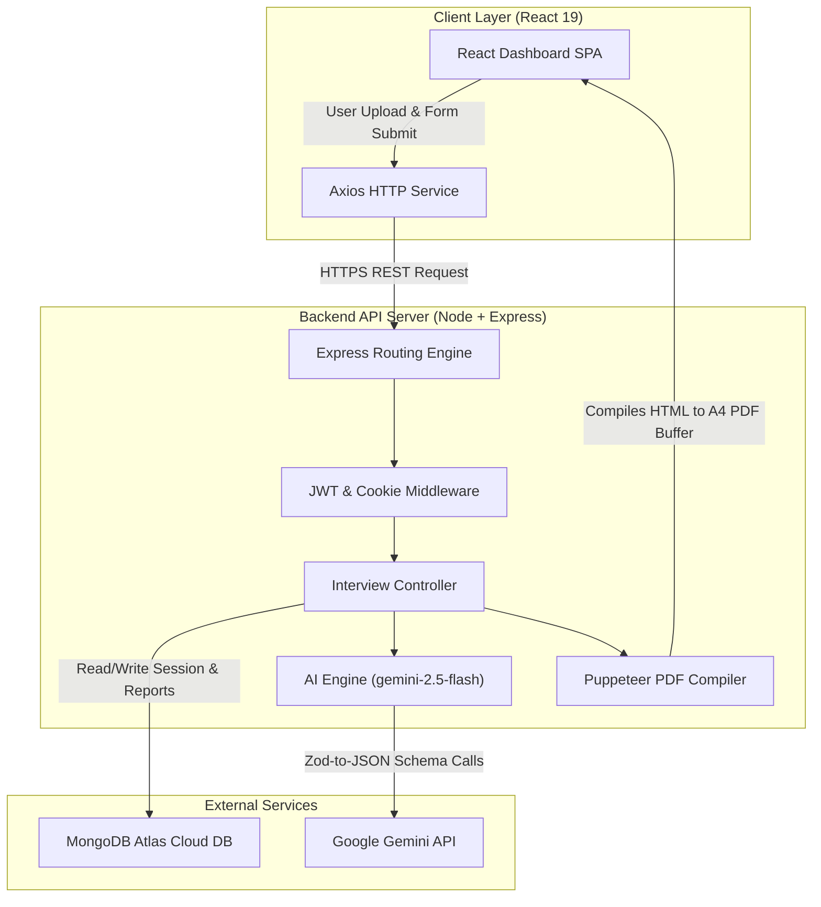
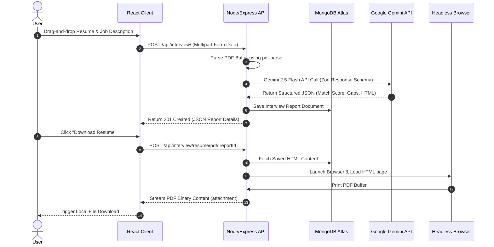

# TalentSync-AI

🚀 **AI-Powered Full-Stack GenAI Interview Preparation Platform**

[](https://talentsync-ai-yv65.onrender.com)
[](https://react.dev/)
[](https://nodejs.org/)
[](https://www.mongodb.com/)
[](https://aistudio.google.com/)
[](LICENSE)

**TalentSync-AI** is a production-grade, AI-powered platform built on the **MERN (MongoDB, Express, React, Node.js) stack** that streamlines SDE interview preparation. Leveraging **Google Gemini 2.5 Flash** via the official `@google/genai` SDK, it performs structured **LLM API calls** to align candidate resumes with targeted job descriptions. The system automatically parses PDF uploads, conducts skill gap analyses, builds day-by-day roadmaps, generates custom interview questions, and compiles tailored, ATS-friendly HTML resumes into downloadable PDFs using a headless Puppeteer browser engine.

---

## 🔗 Live Demo

*   **Frontend Client**: [https://talentsync-ai-yv65.onrender.com](https://talentsync-ai-yv65.onrender.com)
*   **Backend Server API**: [https://talentsync-ai-2od4.onrender.com](https://talentsync-ai-2od4.onrender.com)


---

## 📸 Screenshots

> [!NOTE]
> All interface screenshots should be stored in the `/docs/assets/` directory at your project root.

| Feature View | Screenshot Placeholder |
| :--- | :--- |
| **Authentication Screen** | `` |
| **Dashboard Overview** | `` |
| **Drag-and-Drop Uploader** | `` |
| **Skill Gap Report** | `` |
| **Preparation Roadmap** | `` |
| **Resume Generation** | `` |
| **PDF Download** | `` |

---

## 🌟 Features

### 💻 Frontend Client
*   **React 19 Single Page App**: Fast, modular components styled with structured, maintainable SCSS rules.
*   **Drag-and-Drop File Uploader**: Custom React file selector accepting PDF and DOCX uploads with active file state tracking, size validations, and clear/remove features.
*   **Segmented Navigation**: Tabbed interface to swap between Technical questions, Behavioral questions, and Prep Roadmaps without page reloads.

### ⚙️ Backend Server
*   **RESTful Express API**: Organized model-controller-routing pipeline with Express v5.
*   **Binary Document Parsing**: Integrates `pdf-parse` to extract clean text streams from multipart form data uploads (managed by `multer`).
*   **Puppeteer PDF Compiler**: Spawns a headless browser to print dynamically tailored resume templates into A4 PDF binary streams.

### 🧠 GenAI Integration
*   **Schema-Enforced LLM API Calls**: Enforces Google Gemini to respond only with clean, parsed JSON matching Zod validation models.
*   **Skill Gap Analytics**: Compares resume text with job requirements to determine matching scores and rate skill gap severity (`low`, `medium`, `high`).
*   **Personalized Roadmaps**: Generates custom, calendar-based preparation schedules based on identified candidate weakness areas.

### 🛡️ Security & Performance
*   **Hybrid Session Persistence**: Secure, HTTP-Only cookies combined with an `Authorization: Bearer <token>` header fallback to bypass modern third-party cookie blocking (e.g. Safari's ITP).
*   **JWT Token Authorization**: Stateless session authorization verified via custom Express routing middleware.
*   **Dynamic CORS Policies**: Allows requests only from verified frontend origins, protecting endpoints from unauthorized cross-origin requests.

---

## 🏗️ System Architecture

The following diagram illustrates the boundaries and data flows of the decoupled MERN + GenAI stack:



---

## 🔄 Request Execution Flow

The sequence diagram below visualizes the execution flow when a candidate requests a tailored PDF resume:



---

## 📂 Project Structure

```text
TalentSync-AI/
├── Backend/
│   ├── src/
│   │   ├── config/      # Database connection & env validation
│   │   ├── controllers/ # Auth (register/login) and Interview controllers
│   │   ├── middlewares/ # Auth validation (JWT) and Multer file upload filters
│   │   ├── models/      # Mongoose Models (User, InterviewReport, Blacklist)
│   │   ├── routes/      # Express Router mappings
│   │   └── services/    # Google GenAI connection & Puppeteer PDF compiler
│   ├── server.js        # API entrance point & Port listener
│   └── package.json
│
└── Frontend/
    ├── src/
    │   ├── features/    # Page modules (auth pages, interview pages, context hooks)
    │   ├── style/       # SASS stylesheet rules and variables
    │   ├── app.routes.jsx# React Router v7 browser routes configuration
    │   └── main.jsx     # Frontend entry point
    └── package.json
```

---

## ⚙️ Tech Stack Mappings

### Frontend
| Technology | Category | Purpose |
| :--- | :--- | :--- |
| **React 19** | Library | Component rendering & state management |
| **React Router v7**| Routing | Client-side routing and layout guards |
| **Sass / SCSS** | CSS Preprocessor | Modular nested styling and variables |
| **Axios** | HTTP Client | API calls with custom request interceptors |

### Backend
| Technology | Category | Purpose |
| :--- | :--- | :--- |
| **Node.js** | Runtime | Javascript server-side execution |
| **Express.js v5**| Web Framework | Routing engine & request/response pipelines |
| **Mongoose** | ODM | Schema-based MongoDB modeling |
| **Puppeteer** | Headless Chrome | Server-side HTML-to-PDF compiler |
| **PDF-Parse** | Parser | Binary PDF content text extractor |

### AI, Database & Cloud
| Technology | Category | Purpose |
| :--- | :--- | :--- |
| **Google Gemini 2.5 Flash** | LLM | Context matching, Gap analysis & Resume HTML Generation |
| **Zod** | Validation | Response schemas for Gemini API JSON formatting |
| **MongoDB Atlas** | Database | Cloud document storage |
| **Render** | Cloud Hosting | Backend Web Service & Frontend Static Site deployment |

---

## 🧠 AI Integration Workflow

```text
[Resume PDF Upload] 
       │
       ▼ (pdf-parse extracts text stream)
[Raw Resume Text] + [Job Description Text] + [Self Description]
       │
       ▼ (Prompt injection)
[Structured LLM Prompt]
       │
       ▼ (Google GenAI SDK call using Zod Response Schema)
[Gemini 2.5 Flash Model]
       │
       ▼ (Returns structured JSON)
[Structured JSON Output]
 ├── Match Score (0 - 100)
 ├── Skill Gap List (Low/Medium/High Severity)
 ├── Day-wise Prep Roadmap
 └── Custom ATS-Optimized HTML Resume
       │
       ▼ (Puppeteer starts headless chrome)
[PDF Resume Compilation] ---> [Local Download]
```

---

## 🌐 API Design

### Authentication Endpoints

#### `POST /api/auth/register`
Creates a user account, hashes credentials, and starts a session.
*   **Request Body**:
    ```json
    {
      "username": "deepakofficial34",
      "email": "deepak@example.com",
      "password": "SecurePassword123"
    }
    ```
*   **Response (201 Created)**:
    ```json
    {
      "message": "User registered successfully",
      "token": "eyJhbGciOiJIUzI1NiIsIn...",
      "user": {
        "id": "603d21b...",
        "username": "deepakofficial34",
        "email": "deepak@example.com"
      }
    }
    ```

#### `POST /api/auth/login`
Validates user credentials and returns a secure session token.
*   **Request Body**:
    ```json
    {
      "email": "deepak@example.com",
      "password": "SecurePassword123"
    }
    ```
*   **Response (200 OK)**:
    ```json
    {
      "message": "User loggedIn successfully.",
      "token": "eyJhbGciOiJIUzI1NiIsIn...",
      "user": {
        "id": "603d21b...",
        "username": "deepakofficial34",
        "email": "deepak@example.com"
      }
    }
    ```

### Interview Analysis Endpoints

#### `POST /api/interview/`
Parses candidate details and generates an AI interview report.
*   **Request Headers**: `Authorization: Bearer <token>`
*   **Request Body (Multipart Form Data)**:
    *   `resume`: *[Binary PDF File]*
    *   `jobDescription`: *"Looking for a React developer with knowledge of Node.js..."*
    *   `selfDescription`: *"5 years of full-stack engineering experience..."*
*   **Response (201 Created)**:
    ```json
    {
      "message": "Interview report generated successfully.",
      "interviewReport": {
        "_id": "603d2e5...",
        "user": "603d21b...",
        "matchScore": 85,
        "technicalQuestions": [
          {
            "question": "What is the difference between Virtual DOM and Shadow DOM?",
            "intention": "Verify core understanding of React rendering mechanics.",
            "answer": "The Virtual DOM is React's local copy of..."
          }
        ],
        "skillGaps": [
          {
            "skill": "Docker",
            "severity": "medium"
          }
        ],
        "preparationPlan": [
          {
            "day": 1,
            "focus": "React Rehydration & Performance",
            "tasks": ["Review virtual DOM diffing algorithms", "Study concurrent mode"]
          }
        ],
        "title": "React Developer"
      }
    }
    ```

#### `POST /api/interview/resume/pdf/:interviewReportId`
Compiles and streams the tailored resume as a downloadable PDF.
*   **Request Headers**: `Authorization: Bearer <token>`
*   **Response (200 OK)**:
    *   *Returns binary PDF stream* (`Content-Type: application/pdf`)

---

## 🔒 Security Architectures

1.  **JWT Authentication Scheme**: Session authentication uses state-independent JSON Web Tokens.
2.  **Bcrypt Hashing**: Passwords are securely hashed using the `bcryptjs` library with a salt factor of 10.
3.  **Cross-Origin Isolation (CORS)**: The Express backend explicitly whitelists only the domain set in `FRONTEND_URL` and blocks other origins.
4.  **Cookie Security**: The authentication cookie is set with `HttpOnly`, `Secure` (forcing HTTPS), and `SameSite=None` options.
5.  **Safari ITP Workaround**: Since Safari blocks third-party cookies on cross-origin requests, the React client automatically reads the token from `localStorage` and appends it to the `Authorization: Bearer <token>` header for all API calls.

---

## ⚙️ Environment Variables

### Backend Configuration (`Backend/.env`)
| Key | Type | Description |
| :--- | :--- | :--- |
| **`PORT`** | Number | The port the backend server listens on (defaults to `3000`). |
| **`MONGO_URI`** | String | MongoDB connection URI (e.g. MongoDB Atlas cluster string). |
| **`JWT_SECRET`** | String | Secret key used to sign and verify JWT authentication tokens. |
| **`GOOGLE_GENAI_API_KEY`** | String | Your Google Gemini API Developer Key. |
| **`FRONTEND_URL`** | String | URL of the live frontend (e.g. `https://talentsync-ai-yv65.onrender.com`). |
| **`PUPPETEER_CACHE_DIR`** | String | Location for Chrome downloads on the server (e.g. `/opt/render/project/src/Backend/.puppeteer`). |

### Frontend Configuration (`Frontend/.env`)
| Key | Type | Description |
| :--- | :--- | :--- |
| **`VITE_API_BASE_URL`** | String | Live URL of your backend API service (e.g. `https://talentsync-ai-2od4.onrender.com`). |

---

## 🌐 Production Cloud Deployments (Render & Atlas)

### 1. MongoDB Atlas setup
*   Create a database user and whitelist IP address `0.0.0.0/0` (Allow Access from Anywhere) in MongoDB Atlas settings to let Render backend nodes connect.

### 2. Puppeteer Server Configuration
Render's server environments run on Ubuntu containers, where the default home directory (`/opt/render`) is **not** preserved between the compile (build) and run phases. To prevent Chrome from being deleted on deploy:
*   Set `PUPPETEER_CACHE_DIR` to `/opt/render/project/src/Backend/.puppeteer` (inside the persistent root project directory).
*   Change the Render Build Command to:
    ```bash
    npm install && npx puppeteer browsers install chrome
    ```
    This downloads Chrome directly into the project folder, ensuring it is preserved when the server goes live.

---

## 💻 Local Setup & Installation

### Prerequisites
*   [Node.js](https://nodejs.org/) installed (v18+)
*   [MongoDB](https://www.mongodb.com/) installed locally or a MongoDB Atlas account
*   Google Gemini API Key from [Google AI Studio](https://aistudio.google.com/)

### 1. Backend Server Setup
1.  Navigate to the Backend directory:
    ```bash
    cd Backend
    ```
2.  Install dependencies:
    ```bash
    npm install
    ```
3.  Create a `.env` file based on `.env.example` and fill in your keys.
4.  Start the development server:
    ```bash
    npm run dev
    ```

### 2. Frontend Setup
1.  Navigate to the Frontend directory:
    ```bash
    cd Frontend
    ```
2.  Install dependencies:
    ```bash
    npm install
    ```
3.  Create a `.env` file based on `.env.example` and set `VITE_API_BASE_URL` to `http://localhost:3000`.
4.  Start the React dev client:
    ```bash
    npm run dev
    ```

---


---

## 🔮 Future Improvements
*   **Voice Mock Interview Agent**: Integrate real-time WebRTC audio streams to conduct voice-based interactive mock interviews.
*   **RAG System**: Use vector databases (e.g. Pinecone) to perform Retrieval-Augmented Generation (RAG) on company-specific past interview experiences.
*   **Caching Layer**: Add Redis to cache frequently requested job descriptions and common interview question profiles.
*   **Containerization**: Add Dockerfiles to containerize both services for easy scaling.
*   **Comprehensive Testing Suite**: Add unit tests (Jest) for backend controllers and component integration tests (React Testing Library) for the client.
