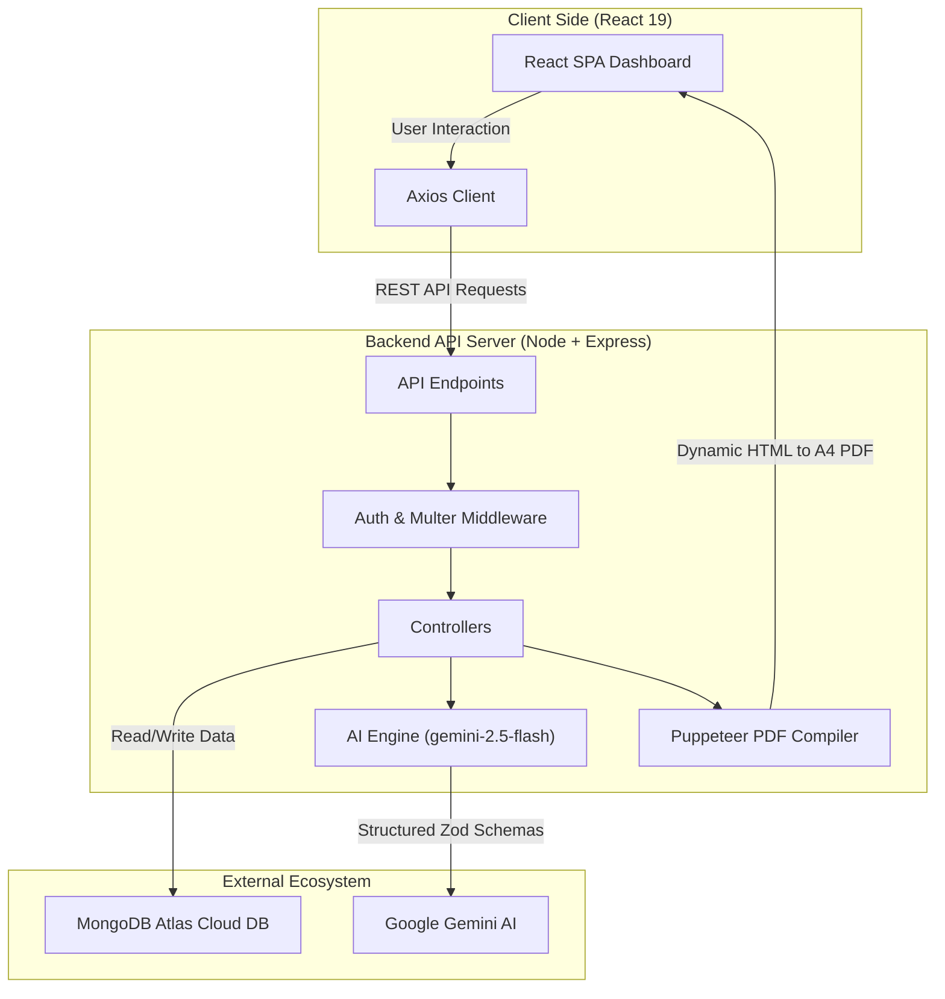

# TalentSync-AI: AI-Powered Full-Stack GenAI Interview Preparation Platform

**TalentSync-AI** is a production-grade, **AI-powered website** built on the **MERN (MongoDB, Express, React, Node.js) stack** featuring advanced **GenAI integration** and **LLM API calls**. The platform helps software developers prepare for technical interviews by matching their profiles against job descriptions to identify skill gaps, generate custom roadmaps, and perform instant **resume generation** with tailored **PDF downloads**.

---

## 🏗️ System Architecture

The application is structured as a decoupled full-stack architecture built to handle **drag-and-drop resume** uploads, asynchronous **LLM API calls**, and dynamic **PDF generation**.



```text
TalentSync-AI/
├── Backend/              # Node.js + Express API Server
│   ├── src/
│   │   ├── config/      # Database & Environment Configuration
│   │   ├── controllers/ # Request controllers (Auth, AI Report Engine)
│   │   ├── middlewares/ # Multer file upload & JWT validation middlewares
│   │   ├── models/      # Mongoose Schemas (User, Report, BlacklistedToken)
│   │   ├── routes/      # REST API endpoints
│   │   └── services/    # Google GenAI Integration & Puppeteer PDF Compiler
│   ├── server.js        # Server entry point
│   └── package.json
│
└── Frontend/             # React 19 Client Dashboard
    ├── src/
    │   ├── features/    # Module-based features (Auth, Interview)
    │   ├── style/       # Modular SCSS styling
    │   ├── app.routes.jsx# React Router v7 configurations
    │   └── main.jsx     # Frontend entry point
    └── package.json
```

---

## 🛠️ Key Technical Implementations (GenAI & SDE Core)

### 1. GenAI Integration & Structured LLM API Calls
*   Leverages the official `@google/genai` SDK to make structured **LLM API calls** using Google's **Gemini 2.5 Flash** model.
*   Enforces strict JSON schema validation by compiling **Zod schemas** into JSON schema definitions (`zod-to-json-schema`), guaranteeing that the LLM response is perfectly parseable and directly maps to our database schemas.

### 2. Drag-and-Drop Resume Uploads & PDF Processing
*   **Drag-and-Drop Resume Uploader**: Implements HTML5 drag-and-drop React handlers with active file state tracking, displaying the selected file name and providing custom validation.
*   **Resume Generation**: The backend uses PDF parsing (`pdf-parse`) to extract text from resumes and prompts Gemini to write tailored, ATS-friendly HTML resumes.
*   **Download PDF**: The server launches a headless **Puppeteer** browser instance to compile the generated HTML into print-ready A4 binary streams, enabling users to **download PDF** resumes on demand.

### 3. Production Deployment & CORS Handling
*   Fully stateless session design utilizing secure, SameSite=None, HTTP-Only cookie authentication alongside an `Authorization: Bearer <token>` header fallback to bypass modern third-party cookie blocking (e.g. Safari's ITP).
*   Dynamic CORS configuration accepting whitelisted origins via the `FRONTEND_URL` environment variable.

---

## 🛠️ Tech Stack & Dependencies

*   **Frontend**: React (v19), React Router (v7), Vite, Sass/SCSS, Axios (custom HTTP client)
*   **Backend**: Node.js, Express.js (v5), MongoDB, Mongoose ODM
*   **AI Integration**: `@google/genai` (Gemini API), `zod-to-json-schema`
*   **PDF Compiler**: Puppeteer (headless PDF engine), PDF-parse, Multer (multipart form parser)
*   **Security & Auth**: JWT (jsonwebtoken), BcryptJS (salted password hashing), Cookie-Parser

---

## ⚙️ Environment Configuration

Create a `.env` file in the `/Backend` directory:
```env
PORT=3000
MONGO_URI=mongodb+srv://<username>:<password>@cluster.mongodb.net/talentsync-db
JWT_SECRET=your_jwt_signing_secret_key
GOOGLE_GENAI_API_KEY=your_gemini_api_key
FRONTEND_URL=https://talentsync-ai-yv65.onrender.com
PUPPETEER_CACHE_DIR=/opt/render/project/src/Backend/.puppeteer
```

Create a `.env` file in the `/Frontend` directory:
```env
VITE_API_BASE_URL=https://talentsync-ai-2od4.onrender.com
```

---

## 🚀 Local Quickstart

### 1. Start the Backend API Server
```bash
cd Backend
npm install
npm run dev
```
Server runs on: `http://localhost:3000`

### 2. Start the Frontend React Client
```bash
cd Frontend
npm install
npm run dev
```
Development client runs on: `http://localhost:5173`

---

## 🌐 Cloud Deployment (Render Production Config)

### 📦 Frontend Deploy (Render Static Site)
*   **Build Command**: `npm run build`
*   **Publish Directory**: `dist`
*   **Environment Variables**:
    *   `VITE_API_BASE_URL`: `https://talentsync-ai-2od4.onrender.com`

### ⚙️ Backend Deploy (Render Web Service)
*   **Build Command**: `npm install && npx puppeteer browsers install chrome` (downloads chrome into target project directory)
*   **Start Command**: `node server.js`
*   **Environment Variables**:
    *   `MONGO_URI` (MongoDB Atlas production URI)
    *   `JWT_SECRET` (Secure JWT key)
    *   `GOOGLE_GENAI_API_KEY` (Gemini API key)
    *   `FRONTEND_URL` (URL of your deployed static frontend)
    *   `PUPPETEER_CACHE_DIR` = `/opt/render/project/src/Backend/.puppeteer` (maps cache to local persistent folder)
