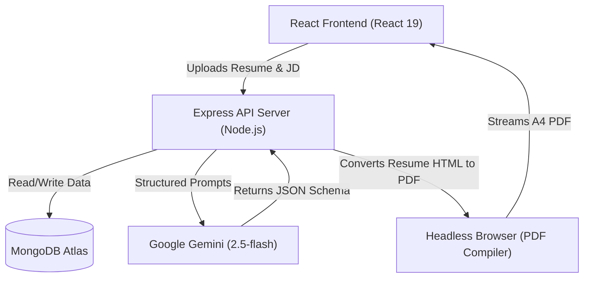

# TalentSync-AI

### 1. Project Overview
TalentSync-AI is a full-stack web application designed for software engineers looking to optimize their technical interview preparation. Built using the MERN stack (MongoDB, Express, React, Node.js), the platform integrates the Google Gemini API to analyze candidate resumes against target job descriptions. By automating skill gap identification, generating day-by-day learning roadmaps, and providing instant PDF resume tailoring, it helps developers focus their study efforts and stand out to technical recruiters.

**Live Website**: [https://talentsync-ai-yv65.onrender.com](https://talentsync-ai-yv65.onrender.com)

---

### 2. Key Features
*   **Secure Authentication**: Handles user registration and logins using JWT authentication with secure HTTP-only cookies and header-based fallbacks.
*   **Drag-and-Drop Resume**: React-based drag-and-drop file uploader with real-time UI file validation.
*   **PDF Resume Parsing**: Extracts raw text from binary PDF uploads using a backend parsing stream.
*   **Job Description Matching**: Compares parsed candidate resumes against job descriptions using LLM analysis.
*   **Skill Gap Analysis**: Identifies missing technical competencies and ranks them by severity (low, medium, high).
*   **Personalized Learning Roadmaps**: Builds customized, day-by-day schedules to address gaps.
*   **ATS Resume Generation**: Generates targeted, professional resume HTML tailored to the job description.
*   **Resume PDF Download**: Converts generated HTML resumes into print-ready A4 PDF downloads using Puppeteer.
*   **LLM API Integration**: Implements Google Gemini 2.5 Flash API calls with Zod schema validations for structured JSON responses.

---

### 3. System Architecture
The application runs as a decoupled full-stack client-server architecture:



---

### 4. Project Structure
```text
TalentSync-AI/
├── Backend/              # Node.js + Express API Server
│   ├── src/
│   │   ├── config/      # Database connection & environment configuration
│   │   ├── controllers/ # Request controllers (Auth, AI Report Engine)
│   │   ├── middlewares/ # Auth validation (JWT) and file upload handlers (Multer)
│   │   ├── models/      # Mongoose Schemas (User, InterviewReport, Blacklist)
│   │   ├── routes/      # Express API router endpoints
│   │   └── services/    # Google GenAI service & Puppeteer PDF compiler
│   └── server.js        # API entrance point & Port listener
└── Frontend/             # React 19 Client Dashboard
    ├── src/
    │   ├── features/    # Module-based features (Auth, Interview pages)
    │   ├── style/       # Modular SCSS stylesheets
    │   └── main.jsx     # Frontend entry point
```

---

### 5. How It Works
The platform runs through the following sequence during a matching workflow:

1.  **Resume Upload**: The candidate uploads their PDF resume via the drag-and-drop uploader.
2.  **PDF Parsing**: The backend extracts raw text streams from the uploaded file using `pdf-parse`.
3.  **Gemini API Processing**: The backend compiles the extracted resume text, self-description, and job description, and makes an LLM API call to Google Gemini.
4.  **Skill Gap Analysis**: Gemini returns structured JSON evaluating match scores and identifying missing technical skills.
5.  **Roadmap Generation**: A day-by-day roadmap is generated to schedule candidate interview preparation.
6.  **Resume Generation**: Gemini generates a custom, ATS-friendly HTML template tailored to the target job description.
7.  **PDF Download**: Puppeteer spins up a headless Chrome instance to compile the generated HTML template into a downloadable A4 PDF document.

---

### 6. Tech Stack

| Layer | Technologies Used |
| :--- | :--- |
| **Frontend** | React 19, React Router v7, Sass, Axios |
| **Backend** | Node.js, Express.js |
| **Database** | MongoDB Atlas, Mongoose ODM |
| **AI** | Google Gemini 2.5 Flash, Zod, Zod-to-JSON Schema |
| **Authentication** | JWT (jsonwebtoken), BcryptJS, Cookie-Parser |
| **Deployment** | Render (Web Service & Static Site) |
| **Tools** | Puppeteer, PDF-Parse, Multer |

---

### 7. Environment Variables

#### Backend (`Backend/.env`)
| Variable | Type | Description |
| :--- | :--- | :--- |
| `PORT` | Number | Port the server listens on (defaults to 3000). |
| `MONGO_URI` | String | MongoDB Atlas database connection string. |
| `JWT_SECRET` | String | Key used to sign JWT authentication tokens. |
| `GOOGLE_GENAI_API_KEY` | String | Google Gemini API developer key. |
| `FRONTEND_URL` | String | URL of the live frontend. |
| `PUPPETEER_CACHE_DIR` | String | Cache location for Puppeteer Chrome downloads. |

#### Frontend (`Frontend/.env`)
| Variable | Type | Description |
| :--- | :--- | :--- |
| `VITE_API_BASE_URL` | String | URL of the backend API server. |

---

### 8. Local Setup

#### 1. Setup the Backend API Server
```bash
cd Backend
npm install
npm run dev
```

#### 2. Setup the Frontend React Client
```bash
cd Frontend
npm install
npm run dev
```

---

### 9. Deployment
*   **Render**: Hosts the frontend as a Static Site and the backend as a Web Service. The backend build command is configured as `npm install && npx puppeteer browsers install chrome` to ensure Chrome is installed locally for PDF exports.
*   **MongoDB Atlas**: Serves as the cloud database engine. Whitelist `0.0.0.0/0` in Atlas Network Access to allow Render backend servers to connect.
*   **Google Gemini API**: Handles prompt engineering queries under the free developer tier.

---

### 10. Future Improvements
*   **Interview Voice Assistant**: Integrating real-time WebRTC audio streams to conduct voice-based mock interviews.
*   **Docker Support**: Adding Dockerfiles and docker-compose configurations to ease local environment setups.
*   **Redis Caching**: Caching frequently processed job descriptions to minimize redundant LLM API queries.
*   **CI/CD Pipeline**: Establishing GitHub Actions for automated unit testing and deployment.
*   **Analytics Dashboard**: Tracking match score progression across multiple user resumes.
*   **Unit & Integration Tests**: Writing backend tests (Jest) and frontend component checks (React Testing Library).
