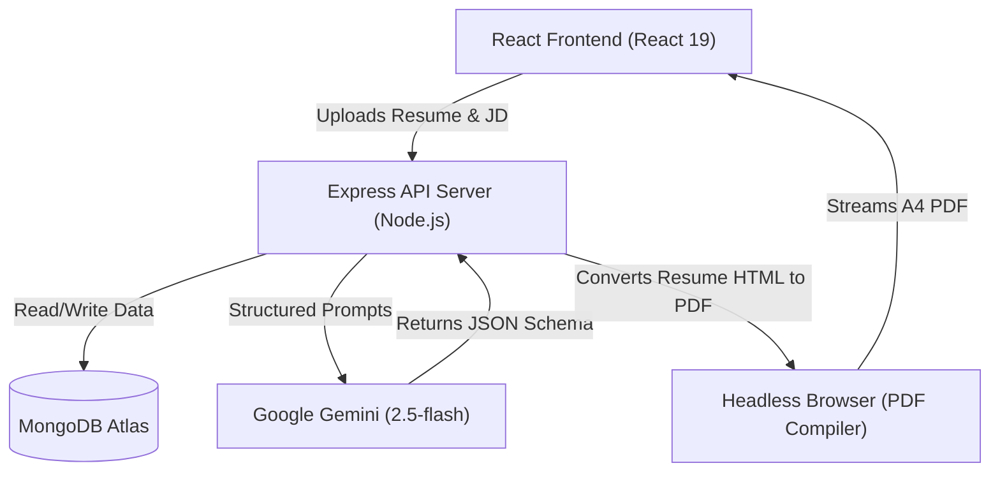

# TalentSync-AI

An AI-powered interview preparation and resume tailoring platform built on the MERN stack. TalentSync-AI compares your resume and target job descriptions using Google Gemini to identify skill gaps, generate daily roadmaps, build custom mock interview questions, and compile tailored, ATS-friendly resumes into downloadable PDFs.

Live Links:
*   **Frontend**: [https://talentsync-ai-yv65.onrender.com](https://talentsync-ai-yv65.onrender.com)
*   **Backend API**: [https://talentsync-ai-2od4.onrender.com](https://talentsync-ai-2od4.onrender.com)

---

## 🏗️ System Architecture



---

## 🌟 Key Features

*   **GenAI Prep Strategy**: Uses the new `@google/genai` SDK and Zod schema validations to get structured analysis (match scores, day-wise prep roadmaps, and custom technical/behavioral practice questions).
*   **ATS Resume Generation**: Generates a tailored HTML resume based on the job description and uses Puppeteer on the backend to print it into a clean, downloadable A4 PDF.
*   **Drag-and-Drop Uploader**: Custom React file selector with live feedback (shows file name, type validation, and a remove button).
*   **Stateless Auth Guard**: Uses secure HTTP-only cookies with a Bearer token header fallback to make authentication work seamlessly across different domains (especially on Safari, which blocks third-party cookies).

---

## 🛠️ Tech Stack

*   **Frontend**: React 19, React Router v7, Sass, Axios
*   **Backend**: Node.js, Express, Mongoose, Multer (file uploads), PDF-parse (extracting text from PDFs)
*   **AI & PDF Compiler**: Google Gemini 2.5 Flash, Puppeteer (headless Chrome)
*   **Database & Cloud**: MongoDB Atlas, Render (hosting)

---

## ⚙️ Environment Variables

### Backend (`Backend/.env`)
```env
PORT=3000
MONGO_URI=mongodb+srv://...
JWT_SECRET=your_jwt_signing_key
GOOGLE_GENAI_API_KEY=your_gemini_api_key
FRONTEND_URL=https://talentsync-ai-yv65.onrender.com
PUPPETEER_CACHE_DIR=/opt/render/project/src/Backend/.puppeteer
```

### Frontend (`Frontend/.env`)
```env
VITE_API_BASE_URL=https://talentsync-ai-2od4.onrender.com
```

---

## 🚀 Local Setup

### 1. Backend API
```bash
cd Backend
npm install
npm run dev
```

### 2. Frontend client
```bash
cd Frontend
npm install
npm run dev
```

---

## 🌐 Deploying to Render (Free Tier)

Since Render's container filesystem is ephemeral (it doesn't keep files downloaded outside the project folder between builds and restarts), we have a custom config to run Puppeteer:

1.  **Build Command**: Update the backend build command to:
    ```bash
    npm install && npx puppeteer browsers install chrome
    ```
2.  **Cache Directory**: Add an environment variable `PUPPETEER_CACHE_DIR` set to `/opt/render/project/src/Backend/.puppeteer`.
3.  **CORS Setup**: Add the `FRONTEND_URL` environment variable pointing to your frontend URL. The backend automatically normalizes trailing slashes.

---

## 🔮 Future Roadmap
*   **Voice Mock Interviews**: Implementing real-time mock interviews using WebRTC voice inputs.
*   **RAG (Retrieval-Augmented Generation)**: Storing past interview questions in a vector database (e.g. Pinecone) to ground AI responses.
*   **Redis Caching**: Cache common job descriptions to avoid redundant LLM API calls.
